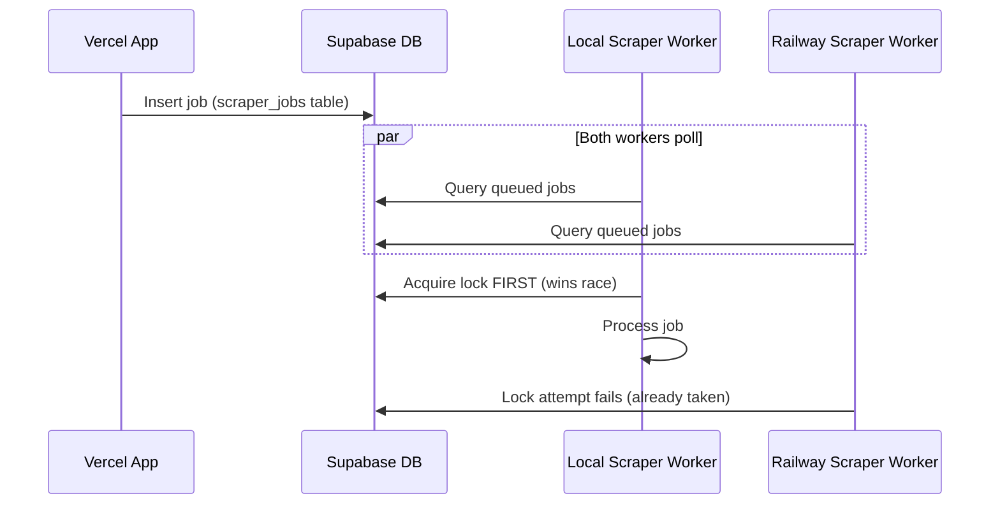

# Fix Scraper Worker Environment Isolation

## Problem Analysis

The issue is **not a code bug in the EBA search functionality**. The architecture uses a database polling model where:

1. The Next.js app (Vercel or local) creates jobs by inserting into the `scraper_jobs` table via `/api/scraper-jobs`
2. The scraper worker (Railway or local) polls the database for queued jobs
3. The first worker to acquire a lock on a job processes it

**Why your local worker is processing Vercel jobs:**

Both the local scraper worker and Railway scraper worker connect to the **same Supabase database**. When you run `pnpm dev:all`, the local worker starts polling and competes with Railway for jobs. Whoever grabs the lock first wins.



## Current Code Flow (Correct)

The EBA search code is correctly implemented:

- [`src/components/employers/FwcEbaSearchModal.tsx`](src/components/employers/FwcEbaSearchModal.tsx) - calls `/api/scraper-jobs` (relative URL)
- [`src/components/projects/SelectiveEbaSearchManager.tsx`](src/components/projects/SelectiveEbaSearchManager.tsx) - calls `/api/scraper-jobs` (relative URL)
- [`src/app/api/scraper-jobs/route.ts`](src/app/api/scraper-jobs/route.ts) - inserts job into database
- [`railway_workers/cfmeu-scraper-worker/src/jobs.ts`](railway_workers/cfmeu-scraper-worker/src/jobs.ts) - polls for `status = 'queued'` jobs

The relative URLs work correctly - they always call the same domain the app is running on.

## Recommended Solutions

### Option 1: Immediate Workaround (No Code Changes)

**Stop the local scraper worker when testing production:**

```bash
# Instead of:
pnpm dev:all

# Run only the Next.js app:
pnpm dev:app
```

This ensures only the Railway worker processes production jobs.

### Option 2: Add Environment Isolation (Recommended Long-term Fix)

Add an `environment` column to jobs so workers only pick up jobs from their environment.

#### Changes Required:

1. **Database migration** - Add `environment` column to `scraper_jobs` table
2. **API route** - Tag jobs with current environment when created
3. **Worker config** - Only process jobs matching worker's environment
```sql
-- Migration
ALTER TABLE scraper_jobs ADD COLUMN environment TEXT DEFAULT 'production';
```
```typescript
// In /api/scraper-jobs/route.ts - tag jobs with environment
const environment = process.env.VERCEL_ENV || process.env.NODE_ENV || 'development';
insertPayload.environment = environment === 'production' ? 'production' : 'development';
```
```typescript
// In worker jobs.ts - filter by environment
const workerEnvironment = process.env.WORKER_ENV || 'production';

const { data: candidates } = await client
  .from(JOB_TABLE)
  .select('*')
  .eq('status', 'queued')
  .eq('environment', workerEnvironment)  // Only process matching jobs
  .in('job_type', ['fwc_lookup', 'incolink_sync'])
  // ...
```


### Option 3: Separate Databases (Most Isolated)

Use a separate Supabase project for local development. This completely isolates the environments but requires maintaining two database schemas.

## Recommendation

- **Immediate**: Use Option 1 - just run `pnpm dev:app` instead of `pnpm dev:all` when testing the production Vercel deployment
- **Long-term**: Implement Option 2 to add environment isolation to the job queue