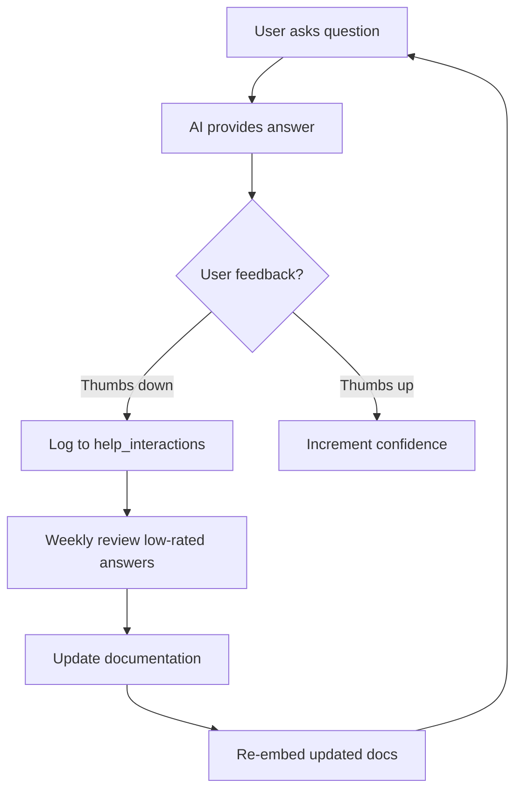

# AI Help System - Quick Start Guide

## 🚀 TL;DR

Implement an AI-powered help chatbot that **never hallucinates** using:
- **RAG** (Retrieval Augmented Generation) with document embeddings
- **Railway Worker** for AI processing (consistent with existing architecture)
- **Gemini Pro** (recommended for MVP - $1.50/month) or OpenAI GPT-4 ($7.50/month)
- **ChromaDB** (free, self-hosted) or Pinecone (managed, $70/month)

**Total Cost: ~$10-20/month**

## 📋 Implementation Steps (5 Weeks)

### Week 1: Documentation Expansion
```bash
# 1. Expand USER_GUIDE.md from 282 → 1000+ lines
# 2. Create structured JSON documentation (see docs/DOCUMENTATION_STRUCTURE.json)
# 3. Add screenshots and diagrams
# 4. Review with actual users

# Files to create/update:
- public/USER_GUIDE.md (expand)
- docs/user-guide.json (new, structured)
- docs/workflows.json (new, step-by-step guides)
- docs/features.json (new, feature reference)
```

### Week 2: Railway Worker Setup
```bash
# Create new worker directory
mkdir -p railway_workers/cfmeu-help-ai-worker/src
cd railway_workers/cfmeu-help-ai-worker

# Initialize project
npm init -y
npm install fastify @fastify/cors openai chromadb dotenv

# Copy starter files from AI_HELP_IMPLEMENTATION_PLAN.md
# - src/index.ts (main server)
# - src/embeddings.ts (document embedding)
# - src/vectorStore.ts (ChromaDB operations)
# - src/aiProvider.ts (Gemini/OpenAI client)
# - src/ragPipeline.ts (RAG orchestration)

# Set environment variables in Railway
GEMINI_API_KEY=your_key_here
CHROMA_HOST=localhost
PORT=3260
CORS_ORIGIN=http://localhost:3000

# Deploy to Railway
railway up
```

### Week 3: RAG Pipeline
```typescript
// Embed documentation (run once)
npm run embed-docs

// Test RAG pipeline
curl -X POST http://localhost:3260/v1/chat \
  -H "Content-Type: application/json" \
  -d '{
    "message": "How do I register a delegate?",
    "context": {
      "page": "/projects/123",
      "role": "organiser"
    }
  }'
```

### Week 4: Frontend Integration
```bash
# Create help components
touch src/components/help/AiHelpDialog.tsx
touch src/app/api/help/chat/route.ts

# Add help button to layout
# See AI_HELP_IMPLEMENTATION_PLAN.md Phase 4 for code

# Test in browser
npm run dev
# Click help button, ask "How do I create a project?"
```

### Week 5: Analytics & Optimization
```sql
-- Run migration for help analytics
-- See AI_HELP_IMPLEMENTATION_PLAN.md Phase 6

-- Monitor metrics
curl http://localhost:3260/v1/metrics
```

## 🎯 Quick Decisions

### Which AI Provider?
**Start with Gemini Pro** ✅
- Cheaper: ~$0.003 per query vs $0.015 for GPT-4
- Free embeddings vs $0.00002 per 1K tokens
- 1M token context window vs 128K
- Good quality for this use case

**Switch to GPT-4 if:** Quality issues, need better reasoning

### Which Vector DB?
**Start with ChromaDB** ✅
- Free, self-hosted on same Railway dyno
- Simple Python/JS client
- Good for <1M vectors

**Switch to Pinecone if:** Scale beyond 1M vectors, need managed solution

### Worker vs Direct API?
**Use Railway Worker** ✅ (per user's memory)
- Keeps API keys secure server-side
- Consistent with existing cfmeu-scraper-worker architecture
- Independent scaling
- Cost control via caching/rate limiting

## 🔐 Preventing Hallucination

### 1. RAG Architecture
```
User Question 
  → Embed question
  → Retrieve top 5 relevant docs from vector DB
  → Include ONLY retrieved docs in AI context
  → Generate answer based on docs
  → Return with citations
```

### 2. Strict System Prompt
```typescript
const systemPrompt = `You are a helpful assistant for the CFMEU Organiser Platform.

CRITICAL RULES:
- ONLY answer based on the provided documentation
- If information is not in the docs, say "I don't have information about that"
- Never make assumptions or invent features
- Always cite the source document
- Provide step-by-step instructions when appropriate`
```

### 3. Low Temperature
```typescript
temperature: 0.1  // Deterministic, factual responses
```

### 4. Confidence Threshold
```typescript
if (confidence < 0.6) {
  return "I don't have enough information to answer that accurately. Please check the documentation or contact support."
}
```

### 5. Response Caching
```typescript
// Cache identical questions for 1 hour
// Prevents repeated API calls AND ensures consistent answers
const cacheKey = hash(`${question}:${context.page}:${context.role}`)
if (cached = getCache(cacheKey)) return cached
```

## 📊 Success Metrics

| Metric | Target | How to Track |
|--------|--------|--------------|
| Adoption Rate | >50% of users | Track help dialog opens |
| Accuracy | >80% positive feedback | Thumbs up/down buttons |
| Response Time | <2s average | Log timestamp start→end |
| Cost | <$50/month | Track API calls & tokens |
| Confidence | >0.75 average | Log vector similarity scores |
| Cache Hit Rate | >40% | Cache hits / total queries |

## 🚨 Common Pitfalls & Solutions

### Pitfall 1: Documentation Drift
**Problem:** Docs get outdated, AI provides wrong info
**Solution:** 
- Version control documentation with app versions
- Automated tests comparing docs to actual UI
- Weekly review of low-confidence responses

### Pitfall 2: High Costs
**Problem:** AI bills exceed budget
**Solution:**
- Aggressive caching (50% hit rate saves 50% cost)
- Rate limiting (20 queries/user/minute)
- Use Gemini instead of GPT-4
- Monitor costs daily via metrics endpoint

### Pitfall 3: Slow Responses
**Problem:** Users wait >5s for answers
**Solution:**
- Cache common questions
- Optimize embeddings (use smaller model)
- Stream responses for better UX perception
- Use worker for parallel processing

### Pitfall 4: Poor Answer Quality
**Problem:** AI gives vague or incorrect answers
**Solution:**
- Improve documentation specificity
- Add more examples and screenshots
- Increase retrieved docs from 5 → 10
- Add user feedback loop to identify gaps

## 🔄 Feedback Loop



## 📝 Maintenance Checklist

### Daily
- [ ] Check worker health endpoint
- [ ] Monitor cost metrics
- [ ] Review error logs

### Weekly
- [ ] Review low-confidence responses
- [ ] Analyze common questions
- [ ] Update documentation if needed
- [ ] Check cache hit rate

### Monthly
- [ ] Re-embed all documentation
- [ ] Review user feedback survey
- [ ] Update RAG pipeline if needed
- [ ] Analyze cost trends

## 🎬 Demo Script

For stakeholder demo:

1. **Show current help system**
   - Static markdown guide
   - No search, no context

2. **Introduce AI help**
   - Click help button
   - "How do I register a delegate?"
   - Show step-by-step answer with screenshots

3. **Demonstrate context awareness**
   - Navigate to Projects page
   - Ask "What can I do here?"
   - Show role-specific guidance

4. **Show hallucination prevention**
   - Ask "Can I delete all projects?"
   - Show "I don't have information about that"
   - Contrast with ChatGPT making up features

5. **Show suggested actions**
   - Ask about mapping sheets
   - Click "View Mapping Sheets" button
   - Navigate directly to feature

## 🚀 Launch Checklist

### Pre-Launch
- [ ] Documentation expanded to 1000+ lines
- [ ] All features documented in structured JSON
- [ ] Worker deployed and tested
- [ ] Embeddings generated and stored
- [ ] Frontend components tested
- [ ] API route secured with auth
- [ ] Database migration applied
- [ ] Accuracy tests passing (>80%)
- [ ] Hallucination tests passing (100%)
- [ ] Cost tracking configured

### Launch Day
- [ ] Deploy worker to Railway production
- [ ] Update HELP_WORKER_URL in Next.js env
- [ ] Deploy Next.js with help button
- [ ] Announce to users
- [ ] Monitor metrics dashboard

### Post-Launch (Week 1)
- [ ] Daily cost check
- [ ] Review all thumbs-down feedback
- [ ] Fix any critical issues
- [ ] Gather user feedback survey

## 📚 Key Files Reference

### Documentation
- `/public/USER_GUIDE.md` - Main user guide (expand this)
- `/docs/DOCUMENTATION_STRUCTURE.json` - Structured docs for embedding
- `/AI_HELP_IMPLEMENTATION_PLAN.md` - Full implementation plan
- `/AI_HELP_QUICKSTART.md` - This file

### Worker
- `/railway_workers/cfmeu-help-ai-worker/src/index.ts` - Main server
- `/railway_workers/cfmeu-help-ai-worker/src/embeddings.ts` - Document embedding
- `/railway_workers/cfmeu-help-ai-worker/src/ragPipeline.ts` - RAG logic

### Frontend
- `/src/components/help/AiHelpDialog.tsx` - Help dialog UI
- `/src/app/api/help/chat/route.ts` - API route
- `/src/components/DesktopLayout.tsx` - Add help button here

### Database
- `/supabase/migrations/YYYYMMDD_help_interactions.sql` - Analytics schema

## 🔗 Resources

- **Gemini API**: https://ai.google.dev/
- **OpenAI API**: https://platform.openai.com/
- **ChromaDB**: https://www.trychroma.com/
- **Pinecone**: https://www.pinecone.io/
- **RAG Guide**: https://www.pinecone.io/learn/retrieval-augmented-generation/

## 💡 Pro Tips

1. **Start simple**: Use Gemini + ChromaDB for MVP, upgrade later if needed
2. **Cache aggressively**: 50% cache hit rate = 50% cost savings
3. **Test hallucination**: Create "trick questions" test suite
4. **Monitor costs**: Set up alerts for >$20/day spend
5. **Iterate documentation**: Let user questions guide doc improvements
6. **Version docs**: Tag documentation with app version for consistency
7. **Stream responses**: Better UX even if total time is same
8. **Mobile-first**: Test help dialog on mobile, ensure good UX
9. **Offline fallback**: Show cached responses when worker is down
10. **Accessibility**: Ensure dialog is keyboard navigable, screen-reader friendly

---

**Next Step:** Start with Week 1 - Expand the user guide! The better the documentation, the better the AI will perform.
