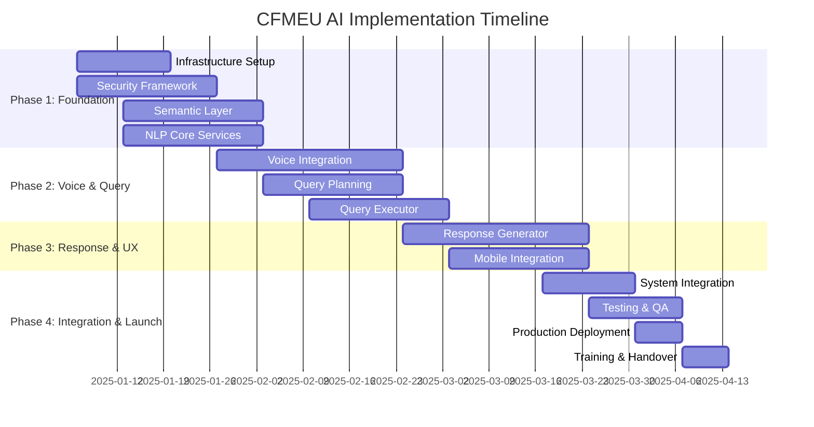
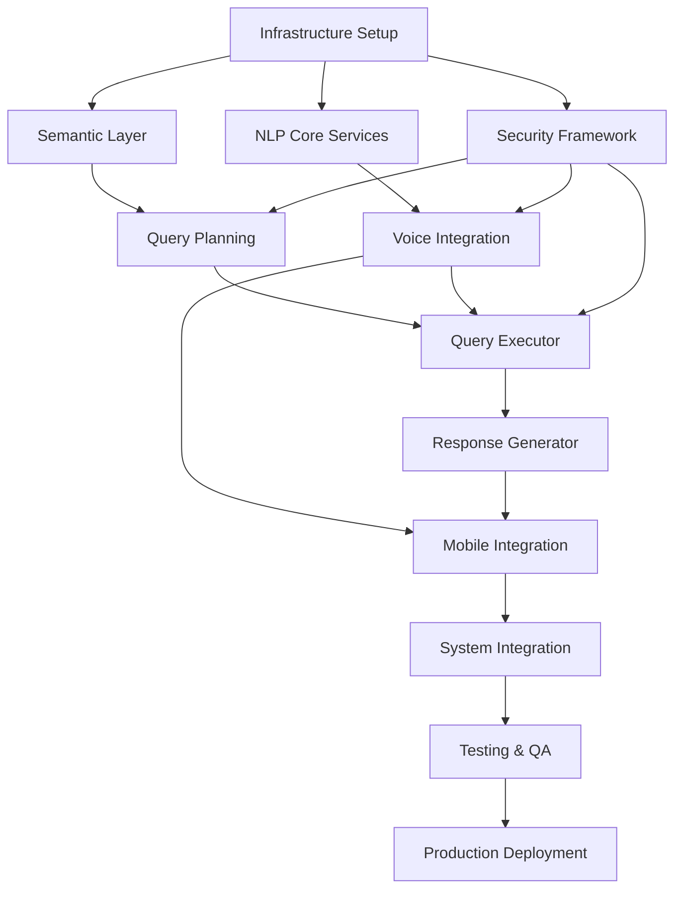

# CFMEU Multi-Agent AI Implementation Workplan
## Natural Language Query System - 16 Week Implementation Plan

---

## 📋 Executive Summary

This workplan coordinates 8 specialized AI agents implementing a natural language query system for CFMEU construction union organisers. The implementation uses a hybrid approach combining Railway.app dedicated services with multiple AI providers (OpenAI, Anthropic, Google) to deliver voice-enabled, mobile-first field capabilities.

**Timeline**: 16 weeks (4 months)
**Budget**: $360,000 implementation + $260/month operational
**Team**: 4.5 FTE across development, security, and operations

---

## 🎯 Implementation Objectives

### Primary Goals
- ✅ Enable natural language queries: "Show me projects in my patch I haven't visited for 6 months"
- ✅ Voice-first operation for construction site environments
- ✅ Mobile-optimized experience for iPhone 13+ field devices
- ✅ Maintain existing security model and RLS policies
- ✅ <2 second response times with 99.9% uptime

### Success Criteria
- 95% query accuracy for common organising workflows
- 90%+ user adoption among field organisers within 3 months
- Sub-2 second response times for 90% of queries
- Zero security breaches or permission bypasses
- 30% efficiency improvement in field data capture

---

## 👥 Agent Overview & Responsibilities

| Agent | Primary Responsibility | Tech Stack | Lead Developer |
|-------|----------------------|------------|----------------|
| **NLP Agent** | Speech-to-text + intent recognition | OpenAI Whisper + Claude 3.5 Sonnet | AI/ML Specialist |
| **Query Planner** | SQL generation + validation | Claude 3.5 Sonnet + security rules | Backend Developer |
| **Semantic Layer** | Entity mapping + context resolution | PostgreSQL + Redis | Data Engineer |
| **Query Executor** | Database operations + RLS enforcement | Supabase + connection pooling | Backend Developer |
| **Response Generator** | Multi-format output + mobile UI | Gemini Pro + React | Frontend Developer |
| **Voice Integration** | Audio processing + TTS | OpenAI Whisper + Web Audio API | Mobile Specialist |
| **Security Architect** | Guardrails + compliance monitoring | Security tools + audit logging | Security Engineer |
| **Infrastructure Architect** | Railway.app deployment + monitoring | Railway.app + observability | DevOps Engineer |

---

## 🗓️ Implementation Timeline Overview

---

## 📅 Detailed Phase-by-Phase Workplan

### Phase 1: Foundation (Weeks 1-4)
**Goal**: Establish core infrastructure, security, and semantic foundation

#### Week 1-2: Infrastructure & Security Setup
**Primary Agent**: Infrastructure Architect + Security Architect

**Infrastructure Tasks**:
- [ ] Set up Railway.app project and service templates
- [ ] Configure service mesh and API gateway
- [ ] Establish monitoring and logging infrastructure
- [ ] Set up CI/CD pipelines for automated deployment
- [ ] Configure secrets management and environment variables

**Security Tasks**:
- [ ] Implement security monitoring and alerting
- [ ] Set up audit logging for all services
- [ ] Configure network security zones and service isolation
- [ ] Implement API rate limiting and DDoS protection
- [ ] Create security incident response procedures

**Dependencies**: None (Kick-off activities)
**Deliverables**:
- Railway.app service infrastructure
- Security monitoring dashboard
- CI/CD pipelines
- Environment configuration documentation

#### Week 1-3: Semantic Layer Development
**Primary Agent**: Semantic Layer Manager

**Tasks**:
- [ ] Design and implement semantic entity mapping system
- [ ] Create database schema for semantic mappings
- [ ] Build synonym and terminology management for construction industry
- [ ] Implement context resolution for user-specific queries
- [ ] Create validation rules for semantic security
- [ ] Set up Redis caching for semantic lookups
- [ ] Build learning system for user feedback incorporation

**Dependencies**: Infrastructure setup (Week 1)
**Deliverables**:
- Semantic mapping database schema
- Entity resolution API service
- Construction industry terminology library
- Context resolution engine
- Semantic caching system

#### Week 2-3: Core NLP Services
**Primary Agent**: NLP Agent

**Tasks**:
- [ ] Implement OpenAI Whisper API integration for speech-to-text
- [ ] Build Claude 3.5 Sonnet integration for intent recognition
- [ ] Create multi-provider fallback system (OpenAI → Claude → Google)
- [ ] Implement noise reduction for construction site audio
- [ ] Build confidence scoring and quality assessment
- [ ] Create audio preprocessing pipeline
- [ ] Implement real-time transcription with partial hypotheses

**Dependencies**: Infrastructure setup (Week 1)
**Deliverables**:
- Speech-to-text service with Whisper integration
- Intent recognition service with Claude integration
- Multi-provider fallback system
- Audio processing pipeline
- Transcription quality monitoring

#### Week 3-4: Security Framework Implementation
**Primary Agent**: Security Architect

**Tasks**:
- [ ] Implement comprehensive security validation framework
- [ ] Create prompt injection detection and prevention
- [ ] Build PII detection and redaction system
- [ ] Implement query allowlist and validation rules
- [ ] Set up data leakage prevention mechanisms
- [ ] Create audit trail system for AI interactions
- [ ] Implement voice data security and encryption

**Dependencies**: Infrastructure setup (Week 1), NLP services (Week 2)
**Deliverables**:
- Security validation framework
- Prompt injection protection system
- PII detection and redaction service
- Query allowlist and validation engine
- Comprehensive audit logging system

#### Week 4: Phase 1 Integration & Testing
**Primary Agent**: All Agents

**Tasks**:
- [ ] Integrate semantic layer with NLP services
- [ ] Connect security framework to all services
- [ ] Perform end-to-end testing of foundation components
- [ ] Validate security measures and penetration testing
- [ ] Optimize performance and fix identified issues
- [ ] Document Phase 1 learnings and adjustments

**Dependencies**: All previous Phase 1 tasks
**Deliverables**:
- Integrated foundation system
- Security test results and penetration testing report
- Performance benchmarks
- Phase 1 completion report

---

### Phase 2: Voice & Query Processing (Weeks 5-8)
**Goal**: Implement voice integration and secure query processing capabilities

#### Week 5-6: Voice Integration System
**Primary Agent**: Voice Integration Specialist

**Tasks**:
- [ ] Implement voice activity detection for noisy environments
- [ ] Build barge-in support and natural conversation flow
- [ ] Create text-to-speech optimization for outdoor audio
- [ ] Implement Australian accent and construction terminology adaptation
- [ ] Build voice UI components with visual feedback
- [ ] Create offline voice capabilities for basic commands
- [ ] Implement audio quality enhancement and noise cancellation

**Dependencies**: NLP services (Phase 1), Security framework (Phase 1)
**Deliverables**:
- Complete voice integration system
- Voice UI components
- Audio quality enhancement system
- Offline voice capabilities
- Australian accent adaptation

#### Week 6-7: Query Planning System
**Primary Agent**: Query Planning Agent

**Tasks**:
- [ ] Implement natural language to SQL conversion
- [ ] Create query validation against semantic schema
- [ ] Build security allowlist enforcement for queries
- [ ] Implement query optimization for existing materialized views
- [ ] Create complex query pattern handling
- [ ] Build query complexity assessment and resource management
- [ ] Implement context-aware query generation

**Dependencies**: Semantic layer (Phase 1), Security framework (Phase 1)
**Deliverables**:
- Query planning service
- SQL generation engine
- Query validation system
- Query optimization engine
- Security validation integration

#### Week 7-8: Query Executor System
**Primary Agent**: Query Executor Agent

**Tasks**:
- [ ] Implement secure parameterized query execution
- [ ] Create Row Level Security enforcement and validation
- [ ] Build connection pooling and performance optimization
- [ ] Implement query timeout and resource management
- [ ] Create result streaming for large datasets
- [ ] Build comprehensive error handling and retry logic
- [ ] Implement query result caching and optimization

**Dependencies**: Query planning system (Week 6-7), Security framework (Phase 1)
**Deliverables**:
- Query execution service
- RLS enforcement system
- Connection pooling optimization
- Query result streaming system
- Error handling and retry mechanisms

#### Week 8: Phase 2 Integration & Testing
**Primary Agent**: All Phase 2 Agents

**Tasks**:
- [ ] Integrate voice system with query planning and execution
- [ ] Connect all security validation across the query pipeline
- [ ] Perform comprehensive testing of voice-to-query workflow
- [ ] Validate query security and RLS enforcement
- [ ] Test voice integration in simulated construction environments
- [ ] Optimize end-to-end performance and fix issues

**Dependencies**: All Phase 2 components
**Deliverables**:
- Complete voice-to-query system
- End-to-end security validation
- Construction environment test results
- Phase 2 performance report

---

### Phase 3: Response Generation & Mobile UX (Weeks 9-12)
**Goal**: Implement multi-format response generation and mobile-optimized user experience

#### Week 9-10: Response Generator System
**Primary Agent**: Response Generator Agent

**Tasks**:
- [ ] Implement natural language response generation with Gemini Pro
- [ ] Create mobile-optimized visualization components
- [ ] Build interactive tables with sorting and filtering
- [ ] Implement multiple export formats (CSV, PDF, Excel)
- [ ] Create voice-friendly response formatting
- [ ] Build contextual adaptation based on user role and query complexity
- [ ] Implement response caching and optimization

**Dependencies**: Query execution system (Phase 2)
**Deliverables**:
- Response generation service
- Mobile visualization components
- Export functionality (CSV, PDF, Excel)
- Voice response formatting
- Response caching system

#### Week 10-11: Mobile Integration & UI Development
**Primary Agent**: Response Generator Agent + Voice Integration Specialist

**Tasks**:
- [ ] Develop React components for voice interaction interface
- [ ] Implement touch and voice hybrid interaction patterns
- [ ] Create outdoor-readable UI with high contrast and large typography
- [ ] Build progressive loading for mobile performance
- [ ] Implement offline capability for critical information
- [ ] Create mobile-specific feedback mechanisms and error handling
- [ ] Optimize for iPhone 13+ devices and construction site use

**Dependencies**: Response generation system (Week 9-10), Voice integration (Phase 2)
**Deliverables**:
- Mobile React components
- Voice interaction interface
- Touch-voice hybrid system
- Mobile performance optimization
- Offline capability implementation

#### Week 11-12: Advanced Features & Optimization
**Primary Agent**: All Agents

**Tasks**:
- [ ] Implement learning system from user feedback
- [ ] Create advanced visualization and analytics features
- [ ] Build contextual suggestions and smart defaults
- [ ] Implement performance optimization across all services
- [ ] Create advanced error handling and recovery mechanisms
- [ ] Build monitoring and analytics for user behavior
- [ ] Optimize for battery usage and mobile data consumption

**Dependencies**: All previous phases
**Deliverables**:
- Learning and feedback system
- Advanced analytics features
- Performance optimizations
- User behavior monitoring
- Battery and data optimization

#### Week 12: Phase 3 Integration & Testing
**Primary Agent**: All Agents

**Tasks**:
- [ ] Integrate response generation with mobile UI components
- [ ] Connect learning system with all agent feedback loops
- [ ] Perform comprehensive mobile testing across devices
- [ ] Validate user experience and accessibility
- [ ] Test offline capabilities and network resilience
- [ ] Optimize performance based on mobile testing results

**Dependencies**: All Phase 3 components
**Deliverables**:
- Complete mobile-optimized system
- Device compatibility test results
- User experience validation report
- Phase 3 performance optimization report

---

### Phase 4: System Integration & Launch (Weeks 13-16)
**Goal**: Final integration, testing, production deployment, and team training

#### Week 13: System Integration & API Development
**Primary Agent**: Infrastructure Architect + All Agents

**Tasks**:
- [ ] Develop main application API endpoints for AI integration
- [ ] Create React hooks for AI query functionality
- [ ] Integrate AI system with existing CFMEU database and workflows
- [ ] Implement comprehensive error handling across all services
- [ ] Create system-wide monitoring and alerting
- [ ] Build backup and disaster recovery procedures
- [ ] Perform integration testing across all components

**Dependencies**: All previous phases
**Deliverables**:
- Complete integrated system
- API documentation and client libraries
- React hooks and frontend integration
- System monitoring and alerting
- Backup and disaster recovery procedures

#### Week 14-15: Comprehensive Testing & Quality Assurance
**Primary Agent**: Security Architect + All Agents

**Tasks**:
- [ ] Perform security penetration testing and vulnerability assessment
- [ ] Conduct load testing and performance validation
- [ ] Execute field testing in actual construction environments
- [ ] Test voice recognition with Australian accents and construction terminology
- [ ] Validate compliance with Australian Privacy Principles
- [ ] Perform user acceptance testing with CFMEU field organisers
- [ ] Fix identified issues and optimize performance

**Dependencies**: Complete integrated system (Week 13)
**Deliverables**:
- Security penetration test report
- Performance and load test results
- Field testing validation report
- Compliance audit results
- User acceptance testing feedback

#### Week 16: Production Deployment & Training
**Primary Agent**: Infrastructure Architect + All Agents

**Tasks**:
- [ ] Deploy all services to Railway.app production environment
- [ ] Configure production monitoring and alerting systems
- [ ] Perform production smoke tests and validation
- [ ] Train CFMEU team on system administration and use
- [ ] Create user documentation and training materials
- [ ] Establish ongoing maintenance and support procedures
- [ ] Conduct project review and lessons learned session

**Dependencies**: Complete testing and validation (Week 14-15)
**Deliverables**:
- Production deployment of complete AI system
- Team training completion
- User documentation and manuals
- Support and maintenance procedures
- Project completion report

---

## 🔗 Agent Dependencies & Coordination

### Critical Path Dependencies

### Parallel Work Opportunities
- **Weeks 1-2**: Infrastructure + Security can work in parallel
- **Weeks 2-3**: Semantic Layer + NLP Services can develop in parallel
- **Weeks 5-6**: Voice Integration + Query Planning can work in parallel
- **Weeks 9-10**: Response Generation + Mobile UI components can develop in parallel
- **Weeks 14-15**: Different types of testing can occur in parallel

### Inter-Agent Communication Protocols
- **Daily Standups**: 15-minute sync with all active agents
- **Weekly Integration Meetings**: Review dependencies and resolve blockers
- **Bi-weekly Architecture Reviews**: Cross-agent design validation
- **Monthly Stakeholder Updates**: Progress review and risk assessment

---

## 👥 Resource Allocation & Team Structure

### Core Implementation Team (4.5 FTE)

| Role | Person | Allocation | Primary Responsibilities |
|------|--------|------------|-------------------------|
| **Lead Developer** | Senior Full Stack | 1.0 FTE | Overall coordination, Query Planning |
| **AI/ML Specialist** | AI Engineer | 1.0 FTE | NLP Agent, Voice Integration |
| **Frontend Developer** | React/Mobile Expert | 1.0 FTE | Response Generator, Mobile UI |
| **Security Engineer** | Security Specialist | 0.5 FTE | Security Architect, compliance |
| **DevOps Engineer** | Infrastructure Expert | 0.5 FTE | Infrastructure Architect, deployment |
| **Data Engineer** | Database Specialist | 0.5 FTE | Semantic Layer, Query Executor |

### External Resources
- **CFMEU Domain Expert**: 0.2 FTE ongoing consultation
- **Construction Site Testers**: 3-5 field organisers for testing
- **Security Auditor**: External penetration testing (Week 14)

---

## ⚠️ Risk Management & Mitigation Strategies

### High-Impact Risks

| Risk | Probability | Impact | Mitigation Strategy |
|------|-------------|---------|-------------------|
| **AI API Rate Limits** | Medium | High | Multi-provider fallback, local caching |
| **Voice Recognition Accuracy** | Medium | High | Training with construction terminology, noise reduction |
| **Security Vulnerabilities** | Low | Critical | Multiple security layers, regular audits |
| **Performance Issues** | Medium | High | Load testing, caching strategies, optimization |
| **User Adoption** | Low | Medium | Early user involvement, training, support |

### Monitoring & Early Warning Indicators
- **Performance**: Response time > 2 seconds triggers alert
- **Security**: Failed authentication > 5 per minute triggers investigation
- **Usage**: Daily query volume < 80% expected triggers review
- **Cost**: Monthly spend > 120% budget triggers optimization review

### Contingency Plans
- **Provider Outage**: Automatic failover to backup AI providers
- **Performance Issues**: Dynamic scaling and query optimization
- **Security Incident**: Immediate isolation and incident response procedures
- **User Feedback Issues**: Rapid iteration and deployment of fixes

---

## 📊 Progress Tracking & Success Metrics

### Weekly Milestone Tracking

| Week | Key Milestone | Success Criteria |
|------|---------------|------------------|
| 2 | Infrastructure Ready | All services deployable, monitoring active |
| 4 | Foundation Complete | Semantic layer + NLP + security integrated |
| 6 | Voice Integration | Voice-to-query working in test environment |
| 8 | Query Pipeline Complete | End-to-end query processing functional |
| 10 | Mobile UI Ready | Touch-voice interface working on mobile |
| 12 | Feature Complete | All planned features implemented |
| 14 | Testing Complete | All test cases passed, security validated |
| 16 | Production Live | System deployed, team trained, users active |

### Key Performance Indicators (KPIs)

**Technical KPIs**:
- System uptime: >99.9%
- Average response time: <2 seconds
- Query accuracy: >95%
- Security incidents: 0
- Mobile performance: <3s load time

**Business KPIs**:
- User adoption: >80% within 3 months
- Task completion rate: >90%
- User satisfaction: >4.5/5 rating
- Efficiency improvement: >30%
- ROI achievement: Within 6 months

---

## 🚀 Implementation Readiness Checklist

### Pre-Implementation Prerequisites
- [ ] Budget approval and resource allocation confirmed
- [ ] Railway.app account setup and billing established
- [ ] AI API accounts created (OpenAI, Anthropic, Google)
- [ ] Development environment access for all team members
- [ ] Communication channels and meeting schedules established
- [ ] Project management tools and repositories configured

### Weekly Kick-off Requirements
- [ ] Previous week deliverables reviewed and accepted
- [ ] Current week tasks assigned and understood
- [ ] Dependencies and blockers identified and addressed
- [ ] Resource availability confirmed
- [ ] Risk assessment updated and mitigation plans activated

---

## 📞 Emergency Contacts & Escalation

**Project Issues**:
- Project Lead: [Contact Information]
- Technical Lead: [Contact Information]
- CFMEU Stakeholder: [Contact Information]

**Production Issues**:
- DevOps Engineer: [Contact Information]
- Security Engineer: [Contact Information]
- Railway.app Support: [Contact Information]

**Security Incidents**:
- Security Engineer: [Contact Information]
- External Security Auditor: [Contact Information]
- CFMEU Leadership: [Contact Information]

---

## 📈 Expected Outcomes

### Immediate Benefits (Post-Launch)
- Voice-enabled queries for field organisers
- 50% reduction in data entry time
- Real-time access to project and compliance information
- Enhanced accuracy in data capture and reporting

### Long-term Benefits (6-12 months)
- Improved organising efficiency through data-driven insights
- Enhanced compliance monitoring and reporting
- Better delegate coordination and task management
- Strategic planning capabilities with advanced analytics

This workplan provides a comprehensive roadmap for implementing the CFMEU AI natural language query system, ensuring coordination across all agents while maintaining security, performance, and user experience standards throughout the implementation process.