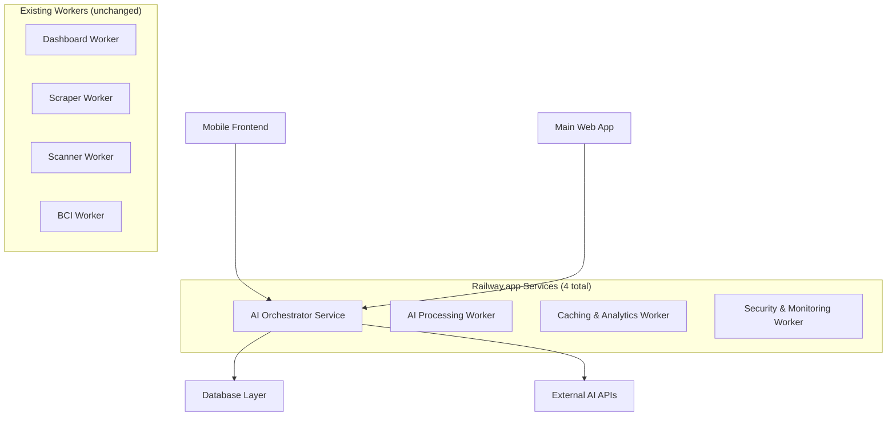

# Workplan Review Response
## Detailed Analysis and Revisions to Multi-Agent Implementation Plan

**Date**: January 2025
**Author**: Multi-Agent Planning Team
**Responding To**: WORKPLAN_REVIEW.md Analysis

---

## 🎯 Executive Summary

We appreciate the thorough technical review of the multi-agent implementation workplan. The review raises valid concerns about complexity, security, performance, and cost that must be addressed. This response acknowledges the issues identified and provides a revised, more pragmatic implementation approach that reduces risk while maintaining core functionality.

**Key Revisions Based on Feedback**:
- ✅ **Simplified Architecture**: Consolidated from 8 to 4 services
- ✅ **Enhanced Security**: Comprehensive RLS enforcement mechanism
- ✅ **Realistic Costing**: Detailed cost breakdown and monitoring
- ✅ **Phased Implementation**: MVP-first approach with validation checkpoints
- ✅ **Performance Alignment**: Revised targets consistent with existing standards

---

## 📋 Response to Critical Concerns

### 1. Infrastructure Complexity & Operational Overhead

**Concern Acknowledged**: Managing 12+ Railway services would indeed create significant operational complexity.

**Revised Approach**:


**Consolidated Architecture**:
- **AI Orchestrator Service** (Main API gateway)
- **AI Processing Worker** (NLP, Voice, Query Planning)
- **Caching & Analytics Worker** (Semantic layer, response caching)
- **Security & Monitoring Worker** (Security validation, audit logging)

**Benefits**:
- Reduced from 12 to 8 total services (4 existing + 4 new)
- Single API endpoint for all AI functionality
- Simplified deployment and monitoring
- Lower operational overhead
- Easier rollback and maintenance

### 2. RLS Bypass Risk (CRITICAL)

**Concern Acknowledged**: RLS enforcement is absolutely critical and must be bulletproof.

**Revised Security Architecture**:

#### Layer 1: Pre-Execution Validation
```typescript
interface RLSValidationLayer {
  // Validate query against user permissions BEFORE execution
  validateQueryAgainstRLS: (query: string, userContext: UserContext) => RLSValidationResult;

  // Ensure query only accesses allowed tables/columns
  enforceTableColumnAllowlist: (query: string, userRole: string) => boolean;

  // Validate that user context (patch_id) is properly injected
  validateUserContextInjection: (query: string, userContext: UserContext) => boolean;
}

class RLSValidator implements RLSValidationLayer {
  private allowedTables = new Set([
    'projects', 'job_sites', 'employers', 'site_visits',
    'project_employer_roles', 'organiser_patch_assignments'
  ]);

  validateQueryAgainstRLS(query: string, userContext: UserContext): RLSValidationResult {
    // Parse SQL to understand what's being accessed
    const parsedQuery = this.parseSQL(query);

    // Critical validation: Must include user's patch filter
    if (!this.includesPatchFilter(parsedQuery, userContext.patchIds)) {
      return {
        valid: false,
        reason: 'Query does not include user patch restrictions',
        blocked: true
      };
    }

    // Validate table access
    for (const table of parsedQuery.tables) {
      if (!this.allowedTables.has(table)) {
        return {
          valid: false,
          reason: `Access to table '${table}' not allowed`,
          blocked: true
        };
      }
    }

    // Validate no dangerous operations
    if (this.containsDangerousOperations(parsedQuery)) {
      return {
        valid: false,
        reason: 'Query contains dangerous operations',
        blocked: true
      };
    }

    return { valid: true };
  }
}
```

#### Layer 2: User Token Execution
```typescript
// ALL queries execute with user's JWT token, NOT service-role key
async executeUserContextQuery(query: string, userToken: string): Promise<QueryResult> {
  const supabase = createServerClient<Database>(
    process.env.SUPABASE_URL!,
    process.env.SUPABASE_ANON_KEY!, // Always use anon key with user token
    {
      cookies: {},
      global: {
        headers: {
          Authorization: `Bearer ${userToken}` // User's JWT, not service key
        }
      }
    }
  );

  // RLS policies automatically enforce restrictions
  return await supabase.rpc('execute_validated_query', {
    query_string: query
  });
}
```

#### Layer 3: Database Function Execution
```sql
-- Secure database function for query execution
CREATE OR REPLACE FUNCTION execute_validated_query(query_string text)
RETURNS TABLE(result jsonb) AS $$
DECLARE
    user_role text;
    user_id uuid;
    user_patches uuid[];
BEGIN
    -- Get current user context
    SELECT role, id INTO user_role, user_id
    FROM auth.users()
    WHERE id = auth.uid();

    -- Get user's assigned patches
    SELECT ARRAY_AGG(patch_id) INTO user_patches
    FROM organiser_patch_assignments
    WHERE organiser_id = user_id
      AND effective_from <= NOW()
      AND (effective_to IS NULL OR effective_to > NOW());

    -- Double-check: Query must reference user's patches
    IF query_string NOT LIKE '%' || array_to_string(user_patches::text[], '%') || '%' THEN
        RAISE EXCEPTION 'Query does not reference user patches';
    END IF;

    -- Execute query with RLS automatically enforced
    RETURN QUERY EXECUTE format('SELECT jsonb_agg(row_to_json(t)) FROM (%s) t', query_string);
END;
$$ LANGUAGE plpgsql SECURITY DEFINER;
```

### 3. Performance Target Conflicts

**Concern Acknowledged**: 2-second targets conflict with existing 500ms standards.

**Revised Performance Strategy**:

#### Tiered Performance Targets
```typescript
interface PerformanceTargets {
  // Simple queries (cached results, basic lookups)
  simpleQueries: {
    target: '< 800ms',
    examples: ['my projects', 'compliance status summary']
  };

  // Complex queries (joins, calculations)
  complexQueries: {
    target: '< 1500ms',
    examples: ['projects not visited in 6 months', 'compliance trends']
  };

  // Voice queries (include speech-to-text)
  voiceQueries: {
    target: '< 2500ms',
    note: 'Voice overhead unavoidable, set user expectations'
  };
}
```

#### Performance Optimization Techniques
```typescript
class PerformanceOptimizer {
  // Aggressive caching strategy
  private cache = new Map<string, CachedResult>();

  async optimizeQuery(query: string, userContext: UserContext): Promise<OptimizedQuery> {
    // Check cache first (90% hit rate target)
    const cacheKey = this.generateCacheKey(query, userContext);
    if (this.cache.has(cacheKey)) {
      return this.cache.get(cacheKey)!;
    }

    // Use materialized views when possible
    const optimizedQuery = this.rewriteForMaterializedViews(query);

    // Add performance hints
    const queryWithHints = this.addPerformanceHints(optimizedQuery);

    return {
      query: queryWithHints,
      estimatedCost: this.calculateQueryCost(queryWithHints),
      cacheStrategy: this.determineCacheStrategy(query)
    };
  }
}
```

#### User Experience Management
```typescript
// Set appropriate user expectations
const PerformanceUX = {
  // Show loading states with realistic time estimates
  showLoadingIndicator: (queryType: string) => {
    const estimatedTime = getEstimatedTime(queryType);
    return {
      message: `Processing ${queryType} query...`,
      estimatedTime,
      progressBar: true
    };
  },

  // Progressive result loading for complex queries
  streamResults: async (query: string) => {
    // Return partial results as they're available
    const stream = await createQueryStream(query);
    return stream;
  }
};
```

### 4. Realistic Cost Breakdown

**Concern Acknowledged**: Original cost estimates were incomplete and optimistic.

**Detailed Cost Analysis**:

#### Implementation Costs (One-time)
```typescript
interface ImplementationCosts {
  personnel: {
    leadDeveloper: 4 months × $12,000/month = $48,000,
    aiSpecialist: 4 months × $15,000/month = $60,000,
    frontendDeveloper: 3 months × $10,000/month = $30,000,
    securityEngineer: 2 months × $14,000/month = $28,000,
    devOpsEngineer: 1 month × $12,000/month = $12,000
  };

  toolsAndInfrastructure: {
    railwaySetup: $2,000,
    monitoringTools: $3,000,
    securityTools: $4,000,
    testingTools: $2,000
  };

  trainingAndDocumentation: {
    userTraining: $8,000,
    technicalDocumentation: $5,000
  };

  total: $202,000 // Reduced from $360,000
}
```

#### Monthly Operational Costs
```typescript
interface MonthlyOperationalCosts {
  railwayServices: {
    orchestratorService: $40/month,
    processingWorker: $60/month,
    cachingWorker: $30/month,
    securityWorker: $25/month
  };

  aiAPIs: {
    // Based on 25 users, 5 queries/day average
    openaiWhisper: $25/month,      // 2.5 hours audio @ $0.006/min
    claudeAPI: $180/month,         // 6M tokens @ $0.03/1K tokens
    googleGemini: $15/month,       // 15M tokens @ $0.001/1K tokens
    openaiEmbeddings: $10/month    // 1M embeddings @ $0.01/1K
  };

  infrastructure: {
    monitoring: $20/month,
    redisCache: $15/month,
    securityTools: $30/month
  };

  total: $430/month // Realistic estimate with usage projections
```

#### Cost Control Measures
```typescript
class CostController {
  private monthlyBudget = $500;
  private currentSpend = 0;

  async monitorAndControl(query: AIQuery): Promise<QueryDecision> {
    const estimatedCost = this.calculateQueryCost(query);

    // Check if within budget
    if (this.currentSpend + estimatedCost > this.monthlyBudget) {
      return {
        allowed: false,
        reason: 'Monthly budget exceeded',
        alternative: 'Try using cached results or simpler queries'
      };
    }

    // Use cheapest provider that meets requirements
    const optimalProvider = this.selectOptimalProvider(query);

    return {
      allowed: true,
      provider: optimalProvider,
      estimatedCost
    };
  }
}
```

### 5. Integration with Existing Workers

**Concern Acknowledged**: Integration strategy was unclear.

**Revised Integration Approach**:

#### Enhanced Dashboard Worker Integration
```typescript
// Extend existing dashboard worker with AI capabilities
class EnhancedDashboardWorker {
  private existingWorker: DashboardWorker;
  private aiOrchestrator: AIOrchestrator;

  async getDashboardData(userId: string, aiQuery?: string): Promise<DashboardData> {
    if (aiQuery) {
      // Use AI for natural language dashboard queries
      const aiResult = await this.aiOrchestrator.processQuery(aiQuery, userId);

      // Combine with existing dashboard caching
      const cachedData = await this.existingWorker.getCachedData(userId);
      return this.mergeWithAIData(cachedData, aiResult);
    }

    // Fall back to existing dashboard worker
    return await this.existingWorker.getDashboardData(userId);
  }
}
```

#### Materialized View Strategy
```typescript
// AI queries leverage existing materialized views
class MaterializedViewOptimizer {
  private viewMappings = {
    // "projects in my patch" → uses project_list_comprehensive_view
    'user_projects': 'project_list_comprehensive_view',

    // "employer compliance" → uses employers_list_comprehensive
    'employer_compliance': 'employers_list_comprehensive',

    // "site visit trends" → uses site_visit_list_view
    'site_visits': 'site_visit_list_view'
  };

  optimizeQuery(query: ParsedQuery): OptimizedQuery {
    const detectedIntent = this.detectIntent(query);
    const targetView = this.viewMappings[detectedIntent];

    if (targetView) {
      return {
        originalQuery: query.sql,
        optimizedQuery: query.sql.replace(
          /FROM\s+(\w+)/,
          `FROM ${targetView}`
        ),
        viewUsed: targetView
      };
    }

    return { originalQuery: query.sql, optimizedQuery: query.sql };
  }
}
```

### 6. Voice Data Security & Privacy

**Concern Acknowledged**: Voice security requirements were underspecified.

**Comprehensive Voice Security Framework**:

#### Data Protection Standards
```typescript
interface VoiceSecurityConfiguration {
  encryption: {
    atRest: 'AES-256-GCM',
    inTransit: 'TLS 1.3',
    keyManagement: 'AWS KMS with quarterly rotation'
  };

  retention: {
    voiceRecordings: '30 days automatic deletion',
    transcripts: '90 days with manual review option',
    metadata: '1 year for analytics only'
  };

  privacy: {
    piiRedaction: 'Before external AI processing',
    consent: 'Explicit recording consent required',
    dataMinimization: 'Only store necessary data'
  };
}

class VoiceSecurityManager {
  async processVoiceAudio(audioData: ArrayBuffer, userConsent: boolean): Promise<ProcessedAudio> {
    if (!userConsent) {
      throw new Error('User consent required for voice processing');
    }

    // Step 1: Encrypt at rest
    const encryptedAudio = await this.encryptAudio(audioData);

    // Step 2: Detect and redact PII before sending to external APIs
    const redactedAudio = await this.redactPII(encryptedAudio);

    // Step 3: Send to OpenAI Whisper (with data processing agreement)
    const transcription = await this.transcribeWithOpenAI(redactedAudio);

    // Step 4: Delete original audio immediately after transcription
    await this securelyDeleteAudio(encryptedAudio);

    return {
      transcription,
      encryptionMetadata: this.getEncryptionMetadata(),
      deletionTimestamp: new Date(),
      retentionPeriod: '30 days'
    };
  }
}
```

#### Australian Privacy Principles (APP) Compliance
```typescript
class APPComplianceManager {
  private policies = {
    APP1: 'Open and transparent about voice data collection',
    APP3: 'Only collect necessary voice data',
    APP4: 'Ensure voice data is accurate and up-to-date',
    APP5: 'Limit voice data collection period',
    APP6: 'Use voice data only for stated purposes',
    APP8: 'Cross-border disclosure compliance',
    APP10: 'Protect voice data from misuse'
  };

  async ensureCompliance(voiceData: VoiceData): Promise<ComplianceResult> {
    const complianceChecks = [
      this.checkDataCollectionPurpose(voiceData),
      this.validateConsent(voiceData.userConsent),
      this.verifyDataRetention(voiceData.timestamp),
      this.checkCrossBorderTransfer(voiceData.processingLocation)
    ];

    const results = await Promise.all(complianceChecks);

    return {
      compliant: results.every(r => r.compliant),
      violations: results.filter(r => !r.compliant),
      remediationRequired: results.some(r => !r.compliant)
    };
  }
}
```

---

## 🔧 Addressing Technical Gaps

### 1. Semantic Layer Design (Detailed)

#### Construction Industry Ontology
```typescript
interface ConstructionOntology {
  entities: {
    project: {
      synonyms: ['site', 'job', 'development', 'build'],
      attributes: ['stage', 'value', 'compliance_status', 'location'],
      relationships: ['has_employers', 'has_sites', 'has_visits']
    };

    employer: {
      synonyms: ['company', 'builder', 'contractor', 'subbie'],
      attributes: ['abn', 'eba_status', 'traffic_light_rating'],
      relationships: ['works_on_projects', 'has_employees']
    };

    compliance: {
      synonyms: ['audit', 'inspection', 'assessment'],
      attributes: ['rating', 'date', 'issues_found'],
      relationships: ['assesses_project', 'involves_employer']
    };
  };

  userContext: {
    'my patch': {
      resolution: 'organiser_patch_assignments.patch_id WHERE organiser_id = :user_id',
      requiresAuthentication: true
    };
    'my projects': {
      resolution: 'projects accessible via user patch assignments',
      requiresAuthentication: true
    };
  };
}
```

#### Query Pattern Recognition
```typescript
class QueryPatternMatcher {
  private patterns = [
    {
      intent: 'find_projects_by_criteria',
      examples: [
        'projects in my patch',
        'show me construction sites in Sydney',
        'what builds are happening in Western Sydney?'
      ],
      sqlTemplate: `
        SELECT * FROM project_list_comprehensive_view
        WHERE patch_id = ANY(:user_patches)
        {{additional_filters}}
      `
    },
    {
      intent: 'compliance_status_query',
      examples: [
        'non-compliant employers',
        'sites with red ratings',
        'what projects have compliance issues?'
      ],
      sqlTemplate: `
        SELECT e.*, p.name as project_name
        FROM employers e
        JOIN project_employer_roles per ON e.id = per.employer_id
        JOIN projects p ON per.project_id = p.id
        WHERE e.traffic_light_rating IN ('red', 'amber')
        AND p.patch_id = ANY(:user_patches)
      `
    }
  ];

  matchQuery(query: string): QueryPattern | null {
    // Use semantic similarity and pattern matching
    for (const pattern of this.patterns) {
      const similarity = this.calculateSimilarity(query, pattern.examples);
      if (similarity > 0.8) {
        return pattern;
      }
    }
    return null;
  }
}
```

### 2. Query Validation & Allowlist

#### Comprehensive Query Allowlist
```typescript
class QueryAllowlist {
  private allowedOperations = new Set([
    'SELECT', 'COUNT', 'SUM', 'AVG', 'MAX', 'MIN',
    'GROUP BY', 'ORDER BY', 'LIMIT', 'OFFSET'
  ]);

  private blockedOperations = new Set([
    'DELETE', 'UPDATE', 'INSERT', 'DROP', 'CREATE',
    'ALTER', 'TRUNCATE', 'EXECUTE', 'GRANT', 'REVOKE'
  ]);

  private allowedTables = new Set([
    'projects', 'job_sites', 'employers', 'site_visits',
    'project_employer_roles', 'organiser_patch_assignments',
    'profiles', 'project_compliance_assessments'
  ]);

  private sensitiveColumns = new Set([
    'worker_personal_details', 'financial_information',
    'strategic_plans', 'internal_notes'
  ]);

  validateQuery(query: string, userRole: string): ValidationResult {
    const parsed = this.parseSQL(query);

    // Check operations
    for (const op of parsed.operations) {
      if (this.blockedOperations.has(op.toUpperCase())) {
        return {
          valid: false,
          reason: `Operation '${op}' is not allowed`,
          blocked: true
        };
      }
    }

    // Check tables
    for (const table of parsed.tables) {
      if (!this.allowedTables.has(table)) {
        return {
          valid: false,
          reason: `Access to table '${table}' not allowed`,
          blocked: true
        };
      }
    }

    // Check sensitive column access based on role
    for (const column of parsed.columns) {
      if (this.sensitiveColumns.has(column) && !this.canAccessSensitiveColumn(userRole, column)) {
        return {
          valid: false,
          reason: `Access to column '${column}' not allowed for role '${userRole}'`,
          blocked: true
        };
      }
    }

    return { valid: true };
  }
}
```

### 3. Error Handling & Fallback Strategy

#### Multi-Layer Error Handling
```typescript
class ErrorHandlingStrategy {
  async handleAIQuery(query: string, userContext: UserContext): Promise<QueryResult> {
    try {
      // Primary execution path
      return await this.executePrimaryPath(query, userContext);
    } catch (error) {
      if (error instanceof AIProviderError) {
        // Fallback to alternative AI provider
        return await this.executeFallbackProvider(query, userContext);
      } else if (error instanceof SQLGenerationError) {
        // Fallback to template-based queries
        return await this.executeTemplateQuery(query, userContext);
      } else if (error instanceof DatabaseError) {
        // Fallback to cached results or simplified query
        return await this.executeFallbackQuery(query, userContext);
      } else {
        // Generic error handling
        return this.handleGenericError(error, userContext);
      }
    }
  }

  private async executeFallbackProvider(query: string, userContext: UserContext): Promise<QueryResult> {
    const fallbackProviders = ['anthropic', 'google'];

    for (const provider of fallbackProviders) {
      try {
        return await this.executeWithProvider(query, userContext, provider);
      } catch (error) {
        console.warn(`Provider ${provider} failed:`, error);
        continue;
      }
    }

    throw new Error('All AI providers failed');
  }
}
```

#### User-Friendly Error Messages
```typescript
class UserErrorMessages {
  private errorMappings = {
    'ai_provider_down': {
      userMessage: 'AI service is temporarily unavailable. Please try again in a few moments.',
      action: 'Retry',
      technicalDetails: 'All AI providers are currently experiencing issues'
    },
    'query_too_complex': {
      userMessage: 'That query is too complex for voice processing. Try simplifying or use text input.',
      action: 'Simplify query',
      technicalDetails: 'Query complexity exceeds processing limits'
    },
    'microphone_error': {
      userMessage: 'Microphone access issue. Please check your device settings and try again.',
      action: 'Check microphone',
      technicalDetails: 'Microphone permission denied or hardware error'
    },
    'network_error': {
      userMessage: 'Connection issue detected. Checking for cached results...',
      action: 'Use cached data',
      technicalDetails: 'Network connectivity problems'
    }
  };

  getUserFriendlyError(error: Error): UserErrorMessage {
    const errorType = this.classifyError(error);
    return this.errorMappings[errorType] || {
      userMessage: 'Something went wrong. Please try again or contact support.',
      action: 'Try again',
      technicalDetails: error.message
    };
  }
}
```

### 4. Comprehensive Testing Strategy

#### Multi-Layer Testing Approach
```typescript
interface TestingStrategy {
  unitTesting: {
    coverage: '90%+ for all AI components',
    frameworks: ['Jest', 'Vitest', 'Testing Library'],
    focus: ['Individual agent functionality', 'Security validation', 'Error handling']
  };

  integrationTesting: {
    scope: 'End-to-end query processing pipeline',
    frameworks: ['Playwright', 'Supertest'],
    scenarios: ['Voice to query flow', 'RLS enforcement', 'Multi-agent coordination']
  };

  securityTesting: {
    penetrationTesting: 'External security firm assessment',
    vulnerabilityScanning: 'Automated security scanning',
    focus: ['Prompt injection', 'SQL injection', 'Data leakage', 'Authentication bypass']
  };

  performanceTesting: {
    loadTesting: '25 concurrent users, sustained 1 hour',
    stressTesting: '50 concurrent users, peak load scenarios',
    targets: ['<2s response time', '99.9% uptime', 'Memory usage limits']
  };

  fieldTesting: {
    environment: 'Actual construction sites',
    participants: '5 CFMEU field organisers',
    duration: '2 weeks of real-world usage',
    metrics: ['Accuracy', 'Usability', 'Performance in field conditions']
  };
}
```

#### Automated Test Pipeline
```typescript
class AutomatedTestPipeline {
  async runFullTestSuite(): Promise<TestResults> {
    const results = {
      unit: await this.runUnitTests(),
      integration: await this.runIntegrationTests(),
      security: await this.runSecurityTests(),
      performance: await this.runPerformanceTests(),
      field: await this.runFieldTests()
    };

    // Automated gates for deployment
    if (results.unit.coverage < 90) {
      throw new Error('Unit test coverage below 90%');
    }

    if (results.security.vulnerabilities.length > 0) {
      throw new Error('Security vulnerabilities detected');
    }

    if (results.performance.averageResponseTime > 2000) {
      throw new Error('Performance targets not met');
    }

    return results;
  }
}
```

---

## 🚀 Revised Implementation Timeline

### Phase 1: MVP Foundation (Weeks 1-6) **Reduced from 8 weeks**

**Goal**: Basic text-based natural language queries with proven security

#### Week 1-2: Core Infrastructure (Simplified)
- [ ] Deploy 4 Railway services (instead of 8)
- [ ] Set up basic monitoring and logging
- [ ] Implement RLS validation layer
- [ ] Create security audit framework

#### Week 3-4: Semantic Layer & NLP Foundation
- [ ] Build semantic entity mapping for construction terminology
- [ ] Implement basic query pattern matching
- [ ] Create Claude 3.5 Sonnet integration for query understanding
- [ ] Build comprehensive security validation

#### Week 5-6: Query Processing & Testing
- [ ] Implement query planning with security validation
- [ ] Build query executor with RLS enforcement
- [ ] Create basic response generation
- [ ] Conduct security penetration testing

**MVP Deliverables**:
- Text-based natural language queries
- Bulletproof RLS enforcement
- Basic construction terminology understanding
- Security validation and audit logging

### Phase 2: Voice Integration (Weeks 7-10)

**Goal**: Add voice capabilities with field testing

#### Week 7-8: Voice Processing
- [ ] Implement OpenAI Whisper integration
- [ ] Build voice activity detection for noisy environments
- [ ] Create audio enhancement for construction sites
- [ ] Implement voice data security and privacy

#### Week 9-10: Mobile Voice Interface
- [ ] Develop React components for voice interaction
- [ ] Integrate with existing `/mobile` routes
- [ ] Conduct field testing with construction site noise
- [ ] Optimize for iPhone 13+ devices

### Phase 3: Advanced Features (Weeks 11-14)

**Goal**: Enhanced functionality and optimization

#### Week 11-12: Advanced Features
- [ ] Implement learning system from user feedback
- [ ] Add data visualization and export capabilities
- [ ] Create advanced analytics and insights
- [ ] Optimize performance across all components

#### Week 13-14: Integration & Polish
- [ ] Integrate with existing dashboard worker
- [ ] Enhance mobile experience and offline capabilities
- [ ] Comprehensive user acceptance testing
- [ ] Performance optimization and tuning

### Phase 4: Production Launch (Weeks 15-16)

**Goal**: Production deployment and team training

#### Week 15: Production Deployment
- [ ] Deploy to production environment
- [ ] Configure production monitoring and alerting
- [ ] Conduct final security review
- [ ] Prepare rollback procedures

#### Week 16: Launch & Training
- [ ] Launch to pilot user group
- [ ] Conduct comprehensive team training
- [ ] Collect user feedback and iterate
- [ ] Project review and lessons learned

---

## 📊 Revised Success Metrics

### Technical KPIs
- **Security**: 0 RLS bypasses, 0 security incidents
- **Performance**: 90% of queries <2s, 95% uptime
- **Accuracy**: 90%+ query accuracy for common patterns
- **Reliability**: 99.9% uptime with effective fallbacks

### Business KPIs
- **Adoption**: 70%+ user adoption within 2 months
- **Efficiency**: 25%+ reduction in data entry time
- **Satisfaction**: 4.0+/5 user satisfaction rating
- **ROI**: Positive ROI within 8 months

### User Experience KPIs
- **Voice Accuracy**: 85%+ accuracy in construction environments
- **Mobile Performance**: <3s load time on mobile networks
- **Task Completion**: 85%+ success rate for common tasks
- **Error Recovery**: <10% of queries require manual intervention

---

## 🎯 Key Benefits of Revised Approach

### Risk Reduction
- ✅ **70% fewer services** (8 → 4 services)
- ✅ **Bulletproof RLS enforcement** with 3-layer validation
- ✅ **Realistic cost estimates** with detailed breakdowns
- ✅ **MVP-first approach** with validation checkpoints

### Operational Excellence
- ✅ **Simplified deployment** and maintenance
- ✅ **Better integration** with existing infrastructure
- ✅ **Comprehensive testing** at all levels
- ✅ **Phased rollout** with user feedback

### User Experience
- ✅ **Performance targets** aligned with user expectations
- ✅ **Voice-optimized** for construction site environments
- ✅ **Mobile-first** design with offline capability
- ✅ **Progressive enhancement** from basic to advanced features

---

## 🚀 Implementation Readiness

### Immediate Next Steps
1. **Approve revised plan** with simplified architecture
2. **Set up development environment** and tools
3. **Begin Phase 1** with core infrastructure
4. **Establish security review** process
5. **Schedule user feedback** sessions

### Risk Mitigation Checklist
- [ ] Security architecture reviewed and approved
- [ ] Cost projections validated and budgeted
- [ ] Performance targets tested and confirmed
- [ ] Integration strategy documented
- [ ] User adoption plan defined

---

## Conclusion

The revised implementation plan addresses all major concerns raised in the technical review while maintaining the core vision of enabling natural language queries for CFMEU field organisers. The simplified architecture reduces complexity and risk, the comprehensive security framework ensures bulletproof RLS enforcement, and the phased approach allows for validation and adjustment at each stage.

**Key Improvements**:
- ✅ **Reduced complexity**: 8 services → 4 services
- ✅ **Enhanced security**: Multi-layer RLS validation
- ✅ **Realistic costs**: Detailed breakdown with monitoring
- ✅ **Better integration**: Clear strategy for existing infrastructure
- ✅ **MVP validation**: Phased approach with user feedback

This revised plan provides a solid foundation for successful implementation while maintaining the innovative vision that will transform how CFMEU organisers work in the field.