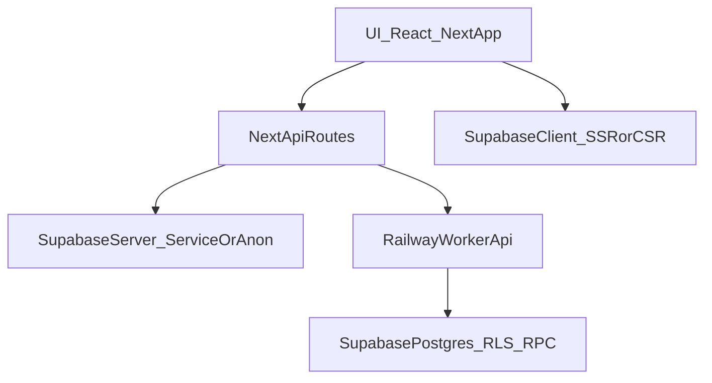

### Debugging Playbook (CFMEU Organiser Platform)

This is a practical, repeatable workflow for debugging issues in this repo. It is intentionally biased toward **mobile-first correctness**, **RLS-first security**, and **multi-service reality** (Next app + Railway workers + Supabase).

See also: `docs/ARCHITECTURE.md`, `claude.md`, `README.md`.

### What to capture before changing code (bug report template)
- **Context**
  - Role: admin / lead_organiser / organiser / delegate / viewer
  - Environment: local / staging / production
  - URL + route (include whether you were in `/mobile`)
  - Device: iPhone model + iOS version (or desktop browser)
- **Repro steps** (numbered, deterministic if possible)
- **Expected vs actual**
- **Scope**
  - One record or many? (single project/employer vs all)
  - Patch-specific? (only certain areas)
- **Evidence**
  - Screenshot(s) (mobile first)
  - Network request/response (status code + payload shape, redact secrets)
  - Logs (Next server + relevant worker)

### Layering model (where bugs usually live)

### Fast triage checklist
- **Is it a permissions issue?**
  - Does admin see it but organiser doesn’t?
  - Does it vary by patch?
  - Is it “empty list” rather than explicit error?
- **Is it a worker integration issue?**
  - Is the feature behind a worker flag/URL?
  - Is the worker reachable from the environment?
  - Are jobs enqueued but not consumed?
- **Is it mobile-only?**
  - Layout/overlay/tap target issues
  - Route redirects (mobile vs desktop)
  - PWA-only behavior (service worker / install / foreground constraints)
- **Is it data volume/perf?**
  - Slow queries, timeouts, huge payloads
  - Client-side filtering of large datasets

### Common failure modes and how to debug

#### Auth/session loss / unexpected logouts
Symptoms: users appear logged out, redirects to `/auth`, random session drops.
- **First checks**
  - Confirm which route group you’re on (`src/app/(app)` vs public routes).
  - Confirm cookies are set and persist across navigation.
  - Check middleware decisions (`src/middleware.ts`) and layout guards (`src/app/(app)/layout.tsx`).
- **Evidence**
  - Network: 302/307 redirects, `Set-Cookie`, and any auth refresh calls.
  - Logs: server output around the time of redirect.
- **Helpful internal docs**
  - `AUTH_SESSION_LOSS_DIAGNOSTIC_REPORT.md`
  - `AUTH_SESSION_LOSS_INVESTIGATION.md`

#### “Data missing” or “I can’t see X” (organiser vs admin)
Symptoms: lists are empty; certain records vanish; organiser sees fewer items than expected.
- **First checks**
  - Confirm user role and patch assignments.
  - Confirm the query uses the right table/view (projects vs job_sites; mapping views; etc).
  - Determine whether rows are filtered by **RLS** vs a bug in query logic.
- **Where to inspect**
  - Query construction in `src/app/**` or `src/lib/**`
  - Supabase client wrappers: `src/lib/supabase/*`
  - RLS policies in `supabase/migrations/**`
- **Notes**
  - Do not “fix” by broadening access in UI; fix the query/policy at the correct layer.

#### Mobile layout regressions
Symptoms: drawer/overlay weirdness, headers translucent, dialogs not covering header, fields overflow.
- **First checks**
  - Reproduce on iPhone-sized viewport first.
  - Validate known non-negotiables (opaque drawer/header/loading overlay).
  - Check shared layout/nav components and any `Dialog/Drawer` usage.
- **Regression net**
  - Prefer `npm run test:mobile:iphone` (or the smallest relevant mobile test).
- **Helpful internal docs**
  - `MOBILE_OPTIMIZATION_GUIDE.md`
  - `MOBILE_NAVIGATION_AUDIT_REPORT.md`
  - `MOBILE_FORM_OPTIMIZATION_REPORT.md`

#### Worker-related features failing (dashboard caching, scanner, scraper, BCI import)
Symptoms: API calls to worker fail; dashboards stale; background jobs stuck; uploads never processed.
- **First checks**
  - Is the worker up and reachable?
  - Is the worker URL configured correctly in this environment?
  - Are Supabase keys set for the worker?
  - Is there a job queue table involved (e.g. `scraper_jobs`)?
- **Where to inspect**
  - `railway_workers/**/src/index.ts`
  - `docs/ARCHITECTURE.md` “Operations & health” section
  - worker deployment docs in root (Railway runbooks)

#### Performance/timeouts on large datasets
Symptoms: slow page loads, 504s, long spinners, API timeouts.
- **First checks**
  - Confirm payload sizes and whether the client fetches too much.
  - Look for client-side filtering/pagination.
  - Identify whether a materialized view exists for the query.
- **Where to inspect**
  - `docs/INDEXES_AND_QUERIES.md`
  - `supabase/migrations/**` (indexes/materialized views)
  - dashboard optimization docs under `docs/`
- **If changing behavior**
  - Prefer adding observability/logging first, then optimize.

### “Tighten the net” mode (optional)
If you are doing a careful stabilization pass, use the existing strictness switch:
- `STRICT_CI=1` makes type errors and eslint failures fatal during build (`next.config.mjs`).

