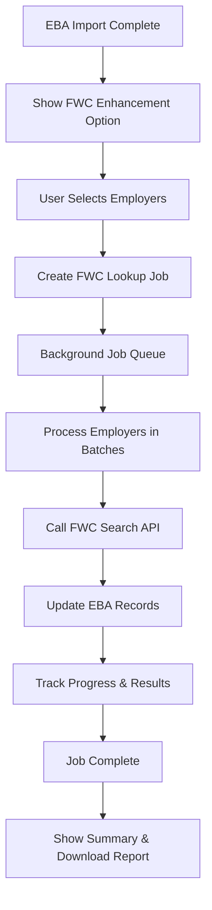

# FWC Lookup Implementation - Option 1: Asynchronous Post-Import Processing

This document describes the implementation of the FWC (Fair Work Commission) lookup functionality that enhances EBA imports with official FWC document data.

## 🎯 **Overview**

The FWC lookup system provides **asynchronous post-import processing** that:
- ✅ Maintains fast EBA import performance  
- ✅ Provides comprehensive FWC data collection
- ✅ Offers non-blocking user experience
- ✅ Includes robust error handling and retry mechanisms
- ✅ Supports batch processing with rate limiting

## 🏗 **Architecture**

### **Core Components**

1. **FwcLookupService** (`/src/services/fwcLookupService.ts`)
   - Singleton service managing background job processing
   - Handles job queue, concurrency limits, and rate limiting
   - Integrates with existing FWC search API

2. **PostImportFwcLookup** (`/src/components/upload/PostImportFwcLookup.tsx`)
   - React component for post-import FWC enhancement UI
   - Real-time progress tracking and job management
   - Employer selection and configuration options

3. **Database Tables** (`/supabase/migrations/0031_fwc_lookup_jobs.sql`)
   - `fwc_lookup_jobs`: Job persistence and status tracking
   - `fwc_lookup_results`: Individual employer lookup results

4. **Type Definitions** (`/src/types/fwcLookup.ts`)
   - Comprehensive TypeScript interfaces for type safety

### **Data Flow**



## 🚀 **Features**

### **Intelligent Employer Analysis**
- Automatically identifies employers without FWC data
- Shows existing FWC status for each employer
- Provides smart selection options (missing FWC data, all, none)

### **Configurable Processing Options**
- **Skip Existing**: Avoid re-processing employers with FWC data
- **Auto-Select Best**: Automatically choose the best matching FWC result
- **Batch Size**: Configurable (1-10 employers per batch)
- **Priority Levels**: Low, Normal, High processing priority

### **Real-Time Progress Tracking**
- Live progress updates during processing
- Current employer being processed
- Success/failure statistics
- Estimated completion time

### **Comprehensive Error Handling**
- Individual employer error tracking
- Retryable vs non-retryable error classification
- Detailed error reporting and download options
- Graceful handling of FWC API timeouts

### **Rate Limiting & Performance**
- 2-second delays between batches (respectful of FWC servers)
- Configurable concurrency limits
- Memory-efficient processing for large datasets
- Background processing doesn't block UI

## 📋 **Usage**

### **Basic Usage**

```typescript
import { FwcLookupService } from '@/services/fwcLookupService';

const service = FwcLookupService.getInstance();

// Create a job for employer FWC lookup
const job = await service.createFwcLookupJob(
  ['employer-id-1', 'employer-id-2'],
  {
    priority: 'normal',
    batchSize: 3,
    skipExisting: true,
    autoSelectBest: true
  }
);

// Monitor job progress
const updatedJob = service.getJob(job.id);
console.log(`Progress: ${updatedJob.progress.completed}/${updatedJob.progress.total}`);

// Get job summary when complete
const summary = service.getJobSummary(job.id);
```

### **Integration with EBA Import**

The FWC lookup is automatically offered after successful EBA imports:

1. **EBA Import Completes** → System checks for successful imports
2. **FWC Enhancement Offered** → UI shows post-import enhancement option
3. **User Configuration** → User selects employers and options
4. **Background Processing** → Job runs asynchronously
5. **Results & Reporting** → Summary and downloadable reports provided

## 🔧 **Configuration Options**

### **Job Options**

```typescript
interface FwcLookupJobOptions {
  priority?: 'low' | 'normal' | 'high';     // Processing priority
  batchSize?: number;                        // Employers per batch (1-10)
  skipExisting?: boolean;                    // Skip employers with FWC data
  autoSelectBest?: boolean;                  // Auto-select best results
  retryAttempts?: number;                    // Retry failed lookups
}
```

### **Performance Settings**

- **Batch Size**: Controls how many employers are processed simultaneously
  - Smaller batches: More respectful of FWC servers, slower processing
  - Larger batches: Faster processing, higher server load
  - Recommended: 3-5 employers per batch

- **Rate Limiting**: 2-second delays between batches (configurable)
- **Timeout Handling**: 45-second timeout per employer lookup
- **Concurrency**: Single job processing to avoid overwhelming FWC

## 📊 **Monitoring & Analytics**

### **Job Statistics**

```typescript
interface FwcLookupJobSummary {
  jobId: string;
  totalEmployers: number;
  processedEmployers: number;
  successfulLookups: number;
  failedLookups: number;
  skippedEmployers: number;
  averageProcessingTime: number;
  totalDuration: number;
  status: 'pending' | 'processing' | 'completed' | 'failed';
}
```

### **Progress Tracking**
- Real-time progress updates via polling
- Current employer being processed
- Estimated time remaining
- Success/failure counts

### **Error Reporting**
- Detailed error logs with timestamps
- Retryable vs permanent error classification
- Downloadable error reports in JSON format
- Individual employer error tracking

## 🗄 **Database Schema**

### **fwc_lookup_jobs Table**
```sql
CREATE TABLE fwc_lookup_jobs (
    id TEXT PRIMARY KEY,
    employer_ids UUID[] NOT NULL,
    status TEXT NOT NULL,
    priority TEXT NOT NULL DEFAULT 'normal',
    progress_completed INTEGER DEFAULT 0,
    progress_total INTEGER NOT NULL,
    current_employer TEXT,
    batch_size INTEGER DEFAULT 5,
    created_at TIMESTAMPTZ DEFAULT NOW(),
    started_at TIMESTAMPTZ,
    completed_at TIMESTAMPTZ,
    estimated_duration INTEGER,
    options JSONB DEFAULT '{}'
);
```

### **fwc_lookup_results Table**
```sql
CREATE TABLE fwc_lookup_results (
    id UUID PRIMARY KEY DEFAULT gen_random_uuid(),
    job_id TEXT REFERENCES fwc_lookup_jobs(id),
    employer_id UUID REFERENCES employers(id),
    employer_name TEXT NOT NULL,
    success BOOLEAN DEFAULT FALSE,
    fwc_results JSONB DEFAULT '[]',
    selected_result JSONB,
    processing_time INTEGER NOT NULL,
    error TEXT,
    created_at TIMESTAMPTZ DEFAULT NOW()
);
```

## 🔒 **Security & Permissions**

### **Row Level Security (RLS)**
- Authenticated users can manage their FWC lookup jobs
- Results are accessible only to authenticated users
- Service role has full access for background processing

### **API Rate Limiting**
- Built-in delays between FWC API calls
- Respectful of FWC server resources
- Configurable rate limiting parameters

## 🧪 **Testing**

### **Unit Tests**
- Comprehensive test suite for FwcLookupService
- Mocked FWC API responses
- Job lifecycle testing
- Error handling validation

### **Integration Tests**
- End-to-end EBA import → FWC lookup flow
- Database persistence testing
- UI component testing

### **Performance Tests**
- Large dataset processing validation
- Memory usage monitoring
- Concurrent job handling

## 🚀 **Deployment & Scaling**

### **Database Migration**
```bash
# Apply the FWC lookup tables migration
supabase db push
```

### **Environment Considerations**
- **Development**: Single job processing, verbose logging
- **Production**: Optimized batch sizes, error monitoring
- **Staging**: Full feature testing with rate limiting

### **Monitoring**
- Job success/failure rates
- Average processing times
- FWC API response times
- Error patterns and frequencies

## 📈 **Performance Characteristics**

### **Processing Times**
- **Per Employer**: ~45 seconds (including FWC API call + processing)
- **Batch Processing**: 3-5 employers per batch with 2-second delays
- **100 Employers**: ~25-30 minutes total processing time

### **Resource Usage**
- **Memory**: Minimal (streaming processing)
- **CPU**: Low (I/O bound operations)
- **Database**: Efficient with proper indexing
- **Network**: Rate-limited FWC API calls

### **Scalability**
- **Horizontal**: Multiple job processors can be added
- **Vertical**: Increased batch sizes for faster processing
- **Queue Management**: Priority-based job processing

## 🔮 **Future Enhancements**

### **Planned Features**
- **Retry Mechanisms**: Automatic retry for failed lookups
- **Scheduling**: Periodic re-checks for updated FWC data
- **Notifications**: Email/SMS alerts for job completion
- **Analytics Dashboard**: Comprehensive FWC lookup analytics

### **Optimization Opportunities**
- **Caching**: Cache FWC search results to reduce API calls
- **Parallel Processing**: Multiple concurrent FWC API calls
- **Smart Matching**: AI-powered employer name matching
- **Bulk Operations**: Batch database updates for performance

---

## 📞 **Support**

For questions or issues with the FWC lookup implementation:
1. Check the error logs in the UI
2. Review job status in the database
3. Verify FWC API connectivity
4. Contact the development team with job IDs and error details

This implementation provides a robust, scalable, and user-friendly solution for enhancing EBA imports with comprehensive FWC document data while maintaining excellent performance and user experience.
